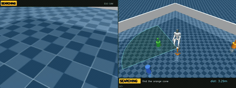

# VLA_mujoco_unitree — Unitree G1 Humanoid VLA in MuJoCo

A small **Vision-Language-Action** policy for a **Unitree G1 humanoid** navigating an object-filled arena from **onboard RGBD + sensor history + a free-form English instruction**. Output: **15-dim lower-body joint targets at 50 Hz**, running in real time in **MuJoCo** (physics only).

The only pretrained weights reused are the **GR00T-N1.6 language model** (frozen, encoded once per episode and cached). Everything else — the policy, the perception (a from-scratch learned detector with a classical HSV+depth fallback), the velocity controller, the obstacle avoidance — is trained/built from scratch on synthetic teacher rollouts plus **DART** recovery data. The locomotion teacher is a Unitree whole-body-control (WBC) walk policy used **only at training time**; deployment is 100% WBC-free (an offline standing keyframe initializes the robot, then the student policy drives every step).

**Skills:** `goto` (navigate to a named object) · `search` (rotate to find an out-of-FOV target, then approach) · `maneuver` (turn L/R after passing a landmark). Plus an interactive demo with an **ego-camera | 3D-diagonal-BEV** view and multi-goal instructions ("find X then find Y").



<sub>Live demo (`code/fancy_demo.py`), full default stack: the instruction names an object 6.8 m away outside the robot's initial field of view; the G1 runs its bounded bidirectional scan (direction reversal visible), spots the cube, then walks to it — passing a **same-color decoy ball 0.37 m off its path** (the learned detector keeps the lock on the *cube* with both red objects in frame; obstacle avoidance skirts the decoy). **Left:** onboard ego camera showing the **active** camera — head camera at range, automatic handoff to a steeper **proximity camera** for the final approach, so the target stays in frame all the way to the stop. **Right:** 3D-diagonal follow-cam with path trail, target ring, FOV cone, and a `SEARCHING → LOCATED → MOVING → REACHED` status banner. Real-time, physics-only, WBC-free.</sub>

## Results (closed-loop, seed 999, n=15, WBC-free deploy)

| Task | Condition | Learned grounding (default) | Classical grounding (fallback) |
|------|-----------|------|------|
| Goto | easy | **100%** | 100% |
| Goto | demo-distance (4–9 m) | **93.3%** | 66.7% |
| Goto | demo / GT goal (locomotion reference) | — | 80.0% |
| Search | out-of-FOV target | **100%** | 100% |
| Maneuver | turn after passing a landmark | **66.7–73.3%** (run-to-run band) | same |

The full system stacks three perception/navigation layers on the distilled walk policy, each adopted only after per-episode no-regression gates:
- **Two-camera handoff** (head + steeper proximity camera): keeps the target detected down to **0.26 m**; a single head camera goes blind below ~0.7 m, before the stop radius.
- **Learned grounding** (`GROUND_NET`, default when its checkpoint is present; classical HSV+depth otherwise): a 0.9M-param query-conditioned heatmap detector trained from scratch on MuJoCo-segmentation-labeled frames. It eliminates the classical grounder's confident false locks at 4–9 m (hue-similar walls, same-color twin distractors) — demo-distance 66.7% → 86.7%, above even the classical stack's 80% GT-goal reference. A realized-yaw fix to the initial scan (the commanded ±90° sweep only physically realized ~±62°) then recovered a target sitting just past the old coverage edge — **93.3%**; the single residual episode is a compound failure that also fails under ground-truth goals.
- **Local obstacle avoidance** (`AVOID`, default on): depth-corridor repulsion at grounding cadence (no extra renders), target- and floor-exempt. Fixes physical path collisions the straight-line steerer couldn't survive — search 93.3% → **100%**.

Policy inference: **3.4 ms/step** (~6× headroom at 50 Hz). 0 falls in the goto/maneuver conditions. EGL-deterministic per seed.

> **Reproducibility note.** These headline numbers are from the released training run. A from-scratch retrain via the two-stage pipeline below reproduces the **GT-goal (pure-locomotion) metrics exactly** — easy/GT **100%**, demo/GT **80%** — which is the load-bearing result (and fixing the curriculum was essential: training `phase_A` on the *combined* set instead of easy-only gives 0% demo). The **classical-grounding** numbers show real run-to-run variance across training draws (grounding-noise robustness is a high-variance property of the fit; a multi-seed sweep spans ~87–100% on easy/classical, and a fresh retrain we verified landed ~73%). Select checkpoints by **closed-loop success, not val-loss**.

> **Generalization across scene seeds.** The table above is the fixed seed-999 episode set; we also validated the full stack on two fresh scene seeds (n=15 each, no tuning): easy 100/87%, demo 87/80%, search 93/100%. The adopted *mechanisms* transfer cleanly — zero falls in 30 fresh search episodes, zero detector failures or fallbacks in 90 fresh episodes, zero scan-coverage misses. The fresh-seed demo drop traces to one known residual: a spawn-geometry-specific walking instability during large early rotations (the distilled policy's limitation, reproduced deterministically; documented rather than patched, since deploy-side mitigations only delay it and policy retraining regressed other skills in two prior attempts).

---

## Hardware / GPU

| Requirement | Specification |
|-------------|---------------|
| GPU | Developed/tested on NVIDIA GB10 (Grace-Blackwell, sm_121); any modern CUDA GPU should work |
| VRAM | ~7 GB (GR00T-N1.6 LM embedding in bf16); the student policy is tiny (7.9 M params, CPU-eligible) |
| RAM | 16 GB+ for training |
| OS | Linux (headless); `MUJOCO_GL=egl` for offscreen render |
| CUDA | 12.8 (torch 2.7.1+cu128) |

---

## Prerequisites (obtain separately — not included in this repo)

1. **GR00T-N1.6 checkpoint** → `checkpoints/GR00T-N1.6-3B/` — HuggingFace `nvidia/GR00T-N1.6-3B` (~6.2 GB, not gated).
2. **GR00T-WholeBodyControl** (the WBC walk ONNX teacher + the G1 MuJoCo model) → under `third_party/`, from NVIDIA's Isaac-GR00T repo (`n1.6.1-release`). The code uses:
   - `third_party/Isaac-GR00T/external_dependencies/GR00T-WholeBodyControl/gr00t_wbc/sim2mujoco/resources/robots/g1/policy/GR00T-WholeBodyControl-Walk.onnx` (teacher)
   - `.../robots/g1/g1_gear_wbc.xml` (G1 MuJoCo model)
3. **Python 3.10 environment** with `requirements.txt`.

> **Run from the repo root** and export `PYTHONPATH` so the local `code` package isn't shadowed by another sourced environment (e.g. ROS): `export PYTHONPATH=.:$PYTHONPATH`. Always set `MUJOCO_GL=egl` for headless rendering (fallback: `xvfb-run -a env MUJOCO_GL=glfw ...`). Some scripts contain machine-specific paths from the dev box — adjust for your environment.

---

## Environment Setup

```bash
# 1. Conda environment (Python 3.10 for GR00T + flash-attn compatibility)
conda create -n g1nav -c conda-forge python=3.10 git-lfs pip -y
conda activate g1nav

# 2. Clone GR00T at the N1.6 release tag (N1.7 main breaks compatibility) and install editable
git clone --branch n1.6.1-release https://github.com/NVIDIA/Isaac-GR00T.git third_party/Isaac-GR00T
pip install -e third_party/Isaac-GR00T --extra-index-url https://download.pytorch.org/whl/cu128

# 3. torch (CUDA 12.8) + flash-attn
pip install torch==2.7.1 torchvision==0.22.1 --index-url https://download.pytorch.org/whl/cu128
pip install flash-attn==2.7.4.post1                 # x86_64; on aarch64 use the prebuilt wheel in the GR00T repo

# 4. Remaining dependencies
pip install -r requirements.txt

# 5. GR00T-N1.6-3B checkpoint (~6.2 GB)
python -c "from huggingface_hub import snapshot_download; snapshot_download('nvidia/GR00T-N1.6-3B', local_dir='checkpoints/GR00T-N1.6-3B')"

# 6. Verify GPU + MuJoCo + GR00T + WBC ONNX load
export PYTHONPATH=.:$PYTHONPATH
MUJOCO_GL=egl python code/check_env.py
```

---

## Dataset Generation (deterministic — seed-reproducible)

```bash
export PYTHONPATH=.:$PYTHONPATH

# Clean easy rollouts (seed 0, 80 episodes)
MUJOCO_GL=egl python code/gen_dataset.py --difficulty easy --seed 0 --num-episodes 80 --out dataset/easy_seed0

# Add the gait-phase column to the clean episodes
python code/gen_dart_dataset.py add-phase --in-dir dataset/easy_seed0 --out-dir dataset/clean_with_phase

# DART easy (seed 42, 200 eps — render-free, fast)
MUJOCO_GL=egl python code/gen_dart_dataset.py generate --difficulty easy --seed 42 --num-episodes 200 --noise 0.07 --out dataset/dart_easy

# DART demo (seed 200, 200 eps; covers all robot start-yaw orientations)
MUJOCO_GL=egl python code/gen_dart_dataset.py generate --difficulty demo --seed 200 --num-episodes 200 --noise 0.07 --maxsteps 1400 --out dataset/dart_demo

# Combine clean + DART into the training set. `combine` merges one clean-dir with one dart-dir;
# the released model trains on dart_combined_v2 = clean_with_phase + dart_easy + dart_demo
# (476 eps / 180,696 frames). Merge the two DART dirs first (or run combine per pair) as needed.
python code/gen_dart_dataset.py combine --clean-dir dataset/clean_with_phase --dart-dir dataset/dart_easy --out dataset/dart_combined_v2

# Maneuver dataset (seed 100; ~159 usable eps after fall-filtering)
MUJOCO_GL=egl python code/gen_maneuver_dataset.py generate --seed 100 --num-episodes 200 --noise 0.07 --maxsteps 1400 --out dataset/maneuver

# GR00T-LM language-embedding cache (2048-d; used by the data loader / language conditioning)
MUJOCO_GL=egl python code/groot_lang.py --ckpt checkpoints/GR00T-N1.6-3B --out dataset/lang_cache.pkl

# Offline standing keyframe (for the WBC-free deploy init)
MUJOCO_GL=egl python code/gen_stand_keyframe.py
```

---

## Training

```bash
export PYTHONPATH=.:$PYTHONPATH

# Stage 1 — Goto policy on the EASY-only set (dart_combined, ~280 eps, yaw=0). This is the
# two-stage curriculum: learn easy locomotion FIRST, then add demo-distance data in stage 2.
# (Training directly on the combined set does NOT reproduce the demo numbers.) 25 epochs (~1.1 h on GB10).
MUJOCO_GL=egl python code/train_dart_phase.py --arch A --data dataset/dart_combined --out runs/dart_phase_A \
    --epochs 25 --batch 64 --lr 3e-4 --swing-weight 2.0 --device cuda

# Stage 2 — Fine-tune on the COMBINED set (dart_combined_v2 = easy + demo DART; fixes yaw covariate shift). 20 epochs.
MUJOCO_GL=egl python code/train_dart_phase.py --arch A --data dataset/dart_combined_v2 \
    --resume-ckpt runs/dart_phase_A/model_best.pt --out runs/demo_dart_A \
    --epochs 20 --batch 64 --lr 1e-4 --reset-epoch --swing-weight 2.0 --device cuda

# Maneuver policy — fine-tune from the goto checkpoint, on maneuver data MIXED with the
# goto set (dart_combined_v2) so the goto skill isn't forgotten
MUJOCO_GL=egl python code/train_maneuver.py --arch A --data dataset/maneuver dataset/dart_combined_v2 \
    --resume-ckpt runs/demo_dart_A/epoch_0003.pt --out runs/maneuver_A \
    --epochs 10 --batch 128 --lr 5e-5 --device cuda
```

> **Select checkpoints by closed-loop success, not offline val-loss** (the two diverge — in our maneuver runs the val-loss minimum is ~27pp worse in closed loop than the behavioral peak, which lands in the first ~3 epochs). For goto use `runs/demo_dart_A/epoch_0003.pt`; for maneuver, sweep the early epochs with `eval_maneuver.py` and take the closed-loop best (epoch 2 in the released run; a from-scratch reproduction peaked at epoch 3, same 73.3%). Copy the chosen ones to `checkpoint/goto_best.pt` and `checkpoint/maneuver_best.pt` (the demo/eval scripts load those by default).

### Learned grounding detector (optional but recommended — the demo-distance headline needs it)

The repo ships **no weights**, so out of the box perception uses the classical HSV+depth grounder (a clear log line says so). To get the learned-grounding numbers, generate the detector dataset and train it (~1.5 h on a GB10-class GPU; the deploy path auto-picks the checkpoint up at `runs/nx6_heatmap_B/model_best.pt`, or set `GROUND_NET_CKPT`):

```bash
# ~11k RGBD frames with pixel-perfect MuJoCo segmentation labels (both deploy cameras,
# 0.3-10 m targets, same-color distractors + hue-similar walls included on purpose)
MUJOCO_GL=egl python code/gen_det_dataset.py --n-easy 90 --n-demo 180 --n-search 80 \
    --seed 7001 --out dataset/det_v1

# Query-conditioned heatmap detector, 0.9M params, from scratch (no pretrained backbone).
# Strengthened same-color/different-shape hard-negative sampling + far-range/wide-bearing
# oversampling, trained to full 60-epoch cosine convergence.
MUJOCO_GL=egl python code/train_nx6_heatmap.py --data dataset/det_v1 --out runs/nx6_heatmap_B \
    --epochs 60 --batch 256 --lr 3e-3 --hard-color-negs 1 --far-oversample 1

# Offline detection metrics (val/test splits)
MUJOCO_GL=egl python code/eval_nx6_heatmap.py --ckpt runs/nx6_heatmap_B/model_best.pt --data dataset/det_v1
```

---

## Evaluation (closed-loop, seed 999)

`eval_closedloop.py` uses `--checkpoint`, `--n`, `--goal-source {learned,classical,gt}`, `--difficulty {easy,demo}`, `--seed`, `--device`. (No GR00T is loaded at eval time — the language embedding is zeroed; navigation is driven by the grounding goal.) **Naming caveat:** `--goal-source classical` selects the *image-grounding pipeline*, which dispatches to the learned detector automatically when its checkpoint is present (`GROUND_NET`, default on) and to classical HSV+depth otherwise — so `--goal-source classical` is what reproduces **both** columns of the results table, depending on whether you trained the detector. (`--goal-source learned` is a legacy in-model grounding head from an early rejected experiment, kept for reference; `gt` is the privileged locomotion reference.)

```bash
export PYTHONPATH=.:$PYTHONPATH

# Goto — easy / classical grounding (~100%)
MUJOCO_GL=egl python code/eval_closedloop.py --checkpoint checkpoint/goto_best.pt --arch A \
    --difficulty easy --goal-source classical --n 15 --seed 999 --device cuda --out eval/easy_classical

# Goto — demo-distance with the trained detector present (~93%): GROUND_NET auto-dispatches
MUJOCO_GL=egl python code/eval_closedloop.py --checkpoint checkpoint/goto_best.pt --arch A \
    --difficulty demo --goal-source classical --n 15 --seed 999 --device cuda --out eval/demo_learned

# Goto — demo-distance, classical fallback (~67%): same command without the detector checkpoint,
# or force it with GROUND_NET=0
MUJOCO_GL=egl GROUND_NET=0 python code/eval_closedloop.py --checkpoint checkpoint/goto_best.pt --arch A \
    --difficulty demo --goal-source classical --n 15 --seed 999 --device cuda --out eval/demo_classical

# Goto — demo / GT goal (~80%); grounding unused, so --no-render is fine
MUJOCO_GL=egl python code/eval_closedloop.py --checkpoint checkpoint/goto_best.pt --arch A \
    --difficulty demo --goal-source gt --n 15 --seed 999 --device cuda --no-render --out eval/demo_gt

# Search — out-of-FOV target (~100%); reuses the goto checkpoint (no search-specific training)
MUJOCO_GL=egl python code/eval_search.py --checkpoint checkpoint/goto_best.pt --n 15 --seed 999 --device cuda --out eval/search

# Maneuver (~73%)
MUJOCO_GL=egl python code/eval_maneuver.py --checkpoint checkpoint/maneuver_best.pt --n 15 --seed 999 --hybrid-vel --device cuda --out eval/maneuver
```

---

## Interactive Demo

`demo.py` and `fancy_demo.py` automatically load `checkpoint/goto_best.pt` and `checkpoint/maneuver_best.pt` (no checkpoint flags needed).

```bash
export PYTHONPATH=.:$PYTHONPATH

# Terminal REPL — type instructions, watch the robot execute (multi-goal + clarification Q&A)
MUJOCO_GL=egl python code/demo.py --difficulty easy --device cuda

# Web UI (Flask MJPEG stream on port 5000)
MUJOCO_GL=egl python code/demo.py --web --difficulty easy --device cuda
```

### Fancy demo — ego | 3D-diagonal BEV, live web UI, long-distance search + multi-goal

`code/fancy_demo.py` shows the **ego camera | elevated 3D-diagonal BEV follow-cam** side-by-side, with overlays: path trail · target ring + crosshair · FOV cone · status banner (`SEARCHING → LOCATED → MOVING → REACHED`) · multi-goal progress dots.

```bash
# Live web UI (port 5001): open http://localhost:5001, type a prompt, watch the live stream
MUJOCO_GL=egl python code/fancy_demo.py --web --device cuda

# Headless showcase render (5 long-distance search + 1 multi-goal, saves MP4s + reel)
MUJOCO_GL=egl python code/fancy_demo.py --smoke --n-smoke 6 --device cuda --out eval/fancy_demo
```

Example prompts: `find the red ball` · `go to the orange cone` · `find the purple ball then find the yellow cube` · `turn left after passing the blue cube`.
Use **red / orange / yellow / purple** objects for the most reliable grounding (cyan/blue can collide with the wall color in HSV — a documented limitation).

To view the web UI from your laptop over SSH: `ssh -L 5001:localhost:5001 <user>@<host>`, run the command above on the host, then open `http://localhost:5001` locally.

---

## Repository Layout

```
VLA_mujoco_unitree/
├── README.md
├── requirements.txt
├── .gitignore
├── assets/demo.gif             # the README demo clip
└── code/                       # source (37 files, incl. __init__.py)
    ├── teacher.py              # WBC teacher wrapper (training-only)
    ├── arena.py  scene.py  steer.py  maneuver_scene.py  maneuver_expert.py
    ├── gen_dataset.py  gen_dart_dataset.py  gen_maneuver_dataset.py  gen_stand_keyframe.py  groot_lang.py
    ├── dataset.py  dataset_phase.py  dataset_maneuver.py
    ├── small_vla.py  train_dart_phase.py  train_gaitfix.py  train_maneuver.py  action_stats.py
    ├── grounding.py            # grounding: learned detector (default when trained) + classical HSV+depth fallback
    ├── gen_det_dataset.py  nx6_heatmap_model.py  nx6_heatmap_data.py     # learned-detector pipeline
    ├── train_nx6_heatmap.py  eval_nx6_heatmap.py  nx6_heatmap_eval_utils.py
    ├── lock_mgmt.py  scan_sched.py  avoid.py    # target-lock hygiene, bounded bidirectional scan, obstacle avoidance
    ├── inferencer.py           # closed-loop deploy (3-rate pipeline, WBC-free)
    ├── eval_closedloop.py  eval_search.py  eval_maneuver.py
    ├── demo.py  fancy_demo.py
    └── check_env.py
```

Created at runtime and **gitignored**: `dataset/`, `runs/`, `checkpoint/`, `eval/`, `videos/`.
External, **not committed**: `checkpoints/` (GR00T-N1.6), `third_party/` (GR00T + WBC).

---

## Method (one paragraph)

Modular VLA: `language → cached GR00T-LM embedding` · `RGBD → classical HSV+depth grounding → egocentric goal (dist, bearing)` · `goal → velocity command` · `velocity + proprio history → distilled 15-DoF joint targets`. The joint policy is distilled from the WBC walk teacher via behavior cloning, and stabilized over long horizons with **residual/normalized action targets + DART recovery data + a gait-phase input** — which is what takes naive BC from 0% to 100% on the easy task. Search is a student-driven **bounded bidirectional scan** (yaw triangle-wave with stand dwells between legs — prolonged continuous rotation is out-of-distribution for the walk policy and was the root cause of all search falls); maneuver adds a landmark-pass trigger + heading goal. Grounding locks are hardened by a blob area-quality floor and an innovation-gated lock replacement (`code/lock_mgmt.py`). Real time comes from a 3-rate split: language once per episode, grounding at 5–10 Hz, the action head at 50 Hz.

**Perception — two-camera handoff.** A single pitched head camera goes blind below ~0.7 m (the target exits the FOV bottom edge before the stop radius). Grounding therefore runs on the **active** one of two head-mounted cameras: the head camera at range, and a steeper **proximity camera** (58° pitch) for the final approach, switched by a hysteresis (Schmitt) trigger on the smoothed target distance (in ≤1.2 m, out ≥1.6 m) with depth-based rejection of the robot's own body in frame. Both cameras feed the same `(dist, bearing)` goal, so the policy needs **no retraining**, and only the active camera is rendered each cycle, so steady-state compute is unchanged. This keeps the target detected down to **0.26 m** — through every skill's stop radius. (A wide-FOV single-camera alternative was A/B-tested and rejected: it loses far-range detection, has a shallower close-range floor, and is ~2× slower.)

**Why a learned detector.** The classical grounder's demo-distance ceiling (66.7% vs 80% under ground-truth goals) is a discrimination limit: at 4–9 m among hue-similar walls, some false HSV+depth locks are geometrically indistinguishable from true ones — we falsified area-, physical-size-, depth-continuity-, shape-, and odometric-coherence-based rejection, each with traced per-episode root causes, before concluding only appearance learning could separate them. The learned detector confirmed that diagnosis (zero confident false locks on the previously-failing episodes). The final piece was **obstacle avoidance**: with accurate grounding the robot walks perfectly straight lines — straight into off-path obstacles the classical stack happened to weave around thanks to its own bearing noise. Depth-corridor repulsion fixed those collisions (search 100%) and only then did the learned-grounding stack clear its adoption gate.
